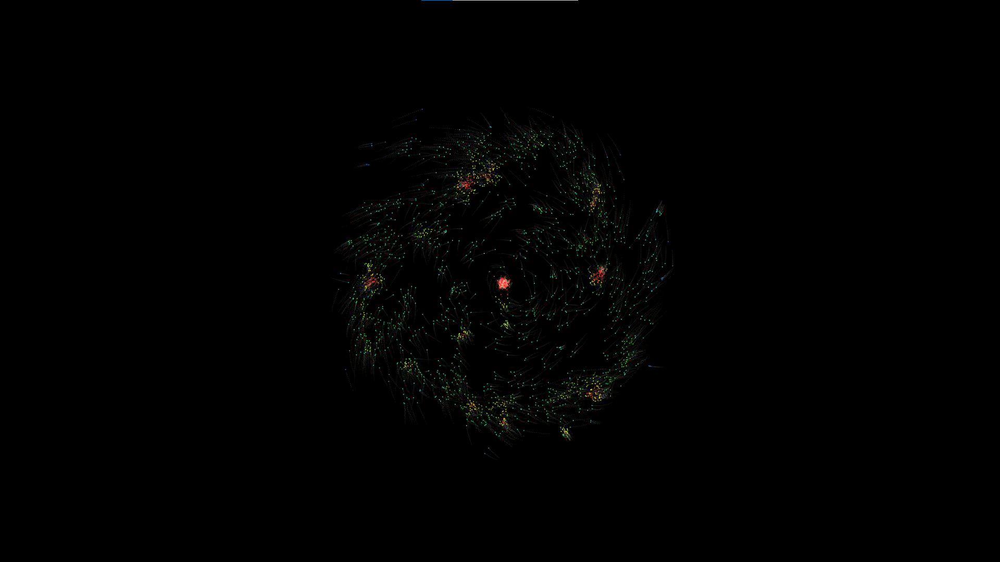
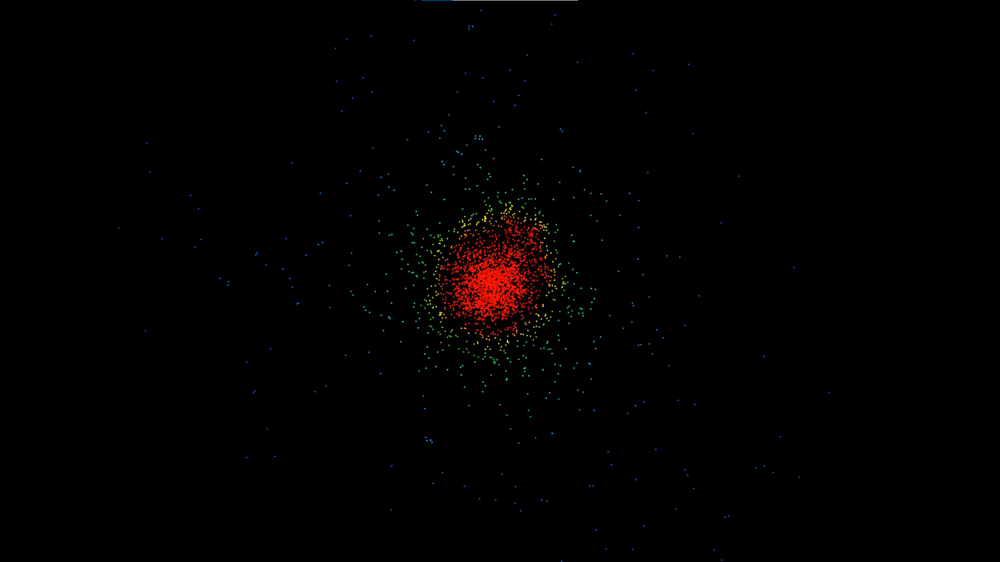
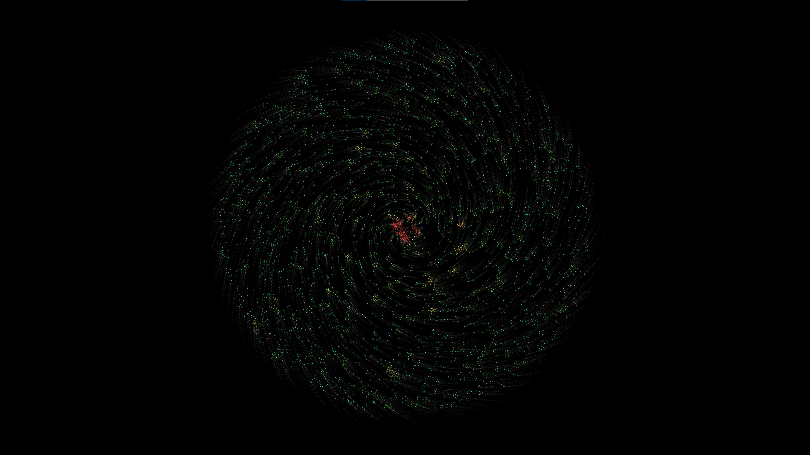
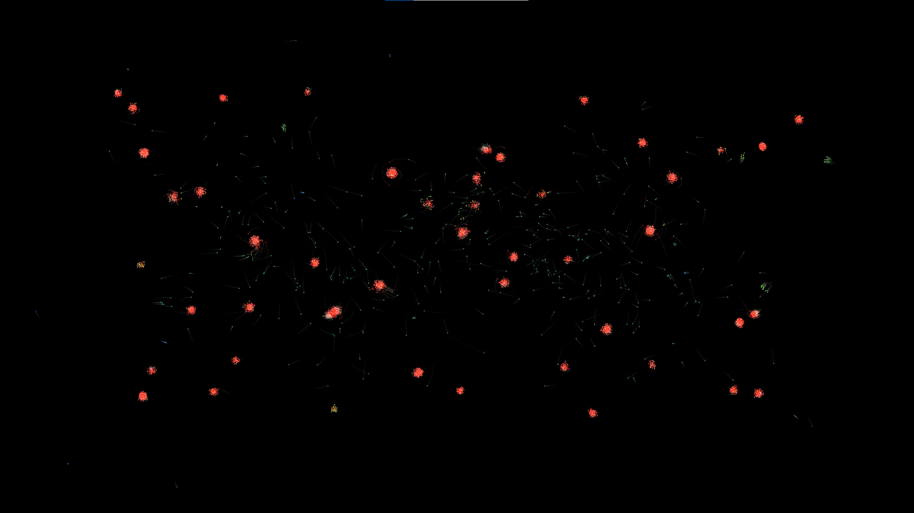

# Gravity Simulation

This is a fun personal project, where I experimented with a particle system with gravitational forces and collisions. There are countless settings, but also a few method that are basically presets for tested scenarios. The color of the particles is dependant on the amount of gravitational force effecting the particle. While the project looks great, it is NOT anywhere near to a realistic simulation.

There are performance issues due to ineffective calculation of forces and collisions. Particles that are too far away to actually have significant effect on the current particle that we are calculating the forces of should not even be considered, same with the collisions. Some form of spatial partitioning algorithm should be implemented to reduce the complexity of calculations. Moreover, I believe my collision mechanics are also not accurate, which sometimes results in strange behaviour. Also, the environment is not made for large amount of calculations (which is required here), so the collisions might be inaccurate due to this, as well. The timestep could be decreased to achieve higher accuracy, but the simulation is already too complex to run smooth real-time.

It has some nice looks, and is fun to experiment with the settings, but my plan is to make a large-scale but real-time version of this with C++ and OpenGL.

Here are some shots:

